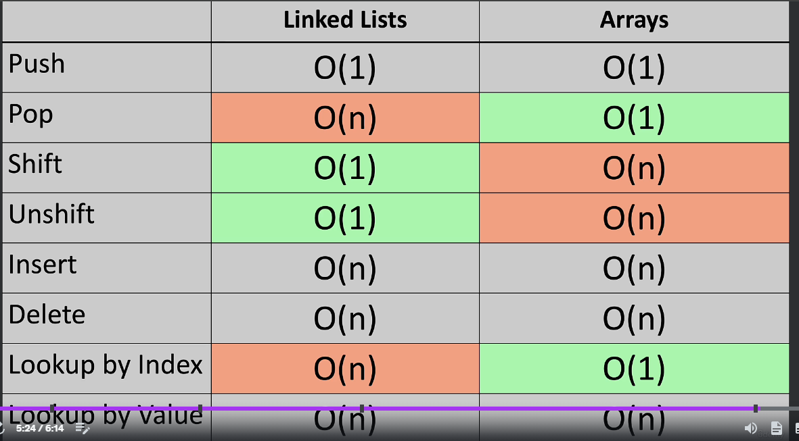

# learnDSA
DSA basics and algorithm

## Linked List
* each element of LL are not in same memory place, but scattered across them memory
* each element has pointer, pointing to next memory location, where next item is present

